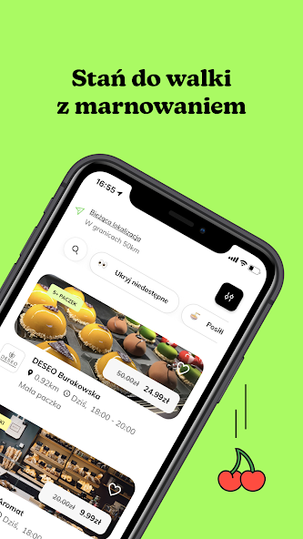
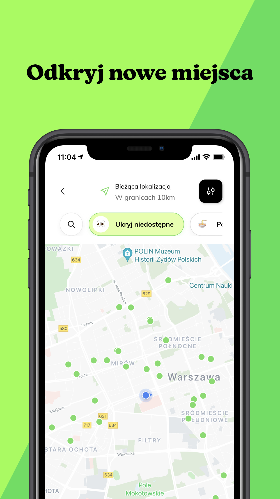
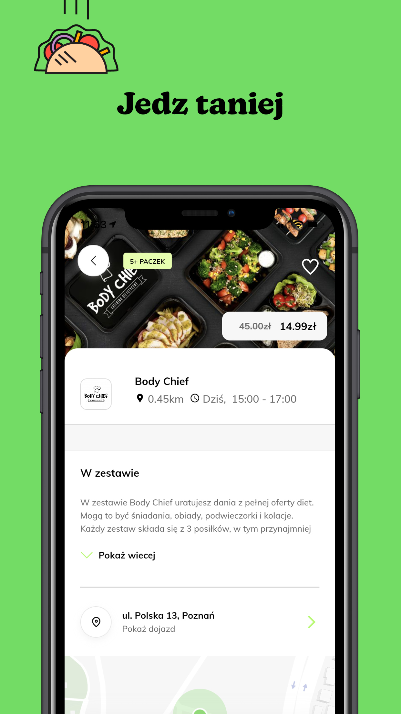
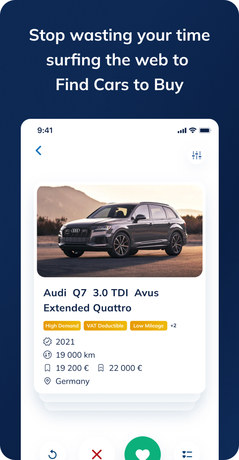
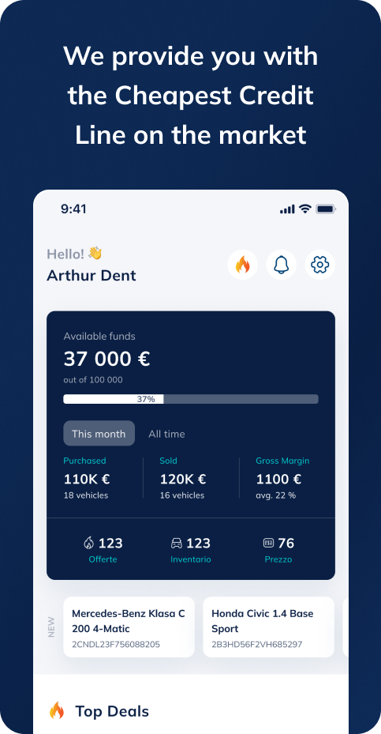
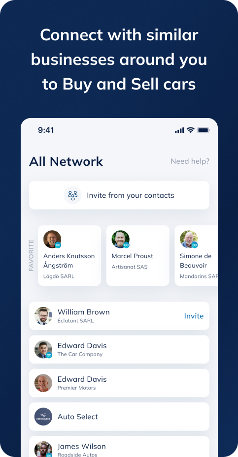
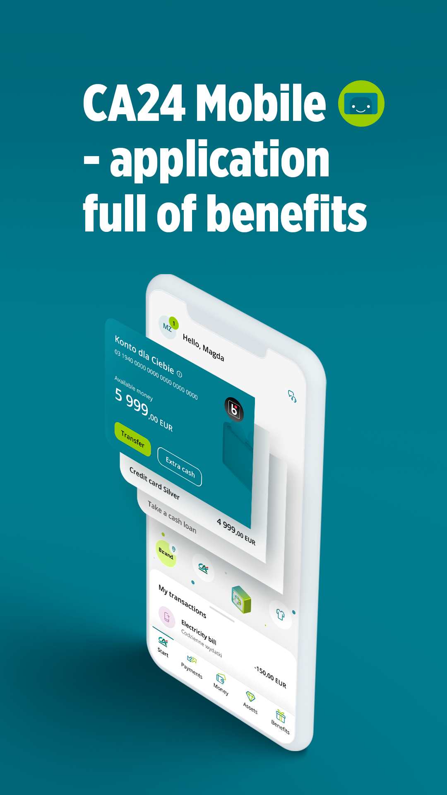
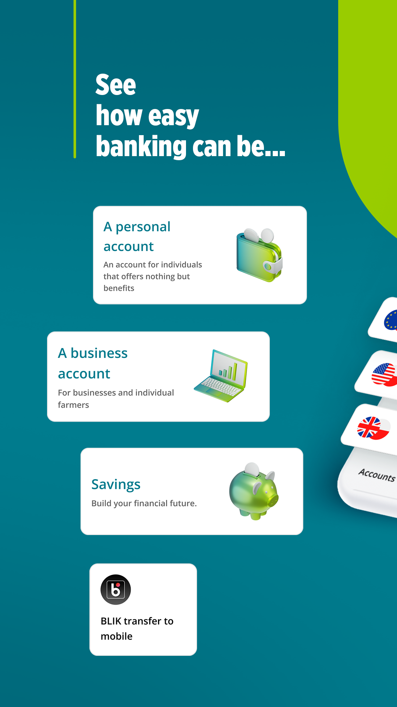

### Hi there 👋

<!--
**jarekb123/jarekb123** is a ✨ _special_ ✨ repository because its `README.md` (this file) appears on your GitHub profile.

Here are some ideas to get you started:

- 🔭 I’m currently working on ...
- 🌱 I’m currently learning ...
- 👯 I’m looking to collaborate on ...
- 🤔 I’m looking for help with ...
- 💬 Ask me about ...
- 📫 How to reach me: ...
- 😄 Pronouns: ...
- ⚡ Fun fact: ...
-->

<!-- # Jaroslaw Butajlo Portfolio -->

<!-- 

## 

 -->

I've worked with many companies and we created beautiful products.

# Foodsi

Period: 2023/04 - until now

Help stop wasting food and other products. 

### Tech stack

* Flutter, Firebase, REST API, JSON:API, Atomic Design System, Figma, Jira, Confluence, Notion
* We have created open-source libraries for Flutter:
  * https://pub.dev/packages/async_cubits
  * https://pub.dev/packages/easy_forms_validation

# LeanCode

https://leancode.co/

Period: 2022/07 - 2023/03 and 2021/04 - 2022/05

## Infinit

App for car dealers: managing cash line, fleet management, find top car deals

### Tech stack

* Flutter, Firebase, CQRS API, Figma, Jira, Notion, Azure DevOps

## Credit Agricole Bank Polska

App for retail and business customers of Polish bank.

I was responsible for developing such features as: regular, saving accounts, credit/debit card management, cross-domain responsive data source.

### Tech stack

* Flutter, Firebase, Custom API protocol, JSON:API, Atomic Design System, Figma, Jira, Confluence

# AllBright Technologies (and its partners)

https://allbright.io

Period: 2019/01 - 2023/03

## AHP

* Android: https://play.google.com/store/apps/details?id=health.allbright.kos&hl=pl
* iOS: https://apps.apple.com/tr/app/ahp-kos-zawa%C5%82/id1618585314
* Web: https://kos.allbright.health/

## Kardiolog

Android: https://play.google.com/store/apps/details?id=app.kardiolog

## Doggies In Town

Android: https://play.google.com/store/apps/details?id=dog.friendly.business.hotels.food.service.finder&hl

## Trainn

* Android: https://play.google.com/store/apps/details?id=com.thetrainn.trainn
* iOS: https://apps.apple.com/pl/app/trainn-personalised-fitness/id1555213815

## Fintech Connector

* iOS: https://apps.apple.com/pl/app/fintech-connector/id1506602133

## PIA

* Android: https://play.google.com/store/apps/details?id=health.pia.app&hl=pl

## ... and more (descriptions to be added)

